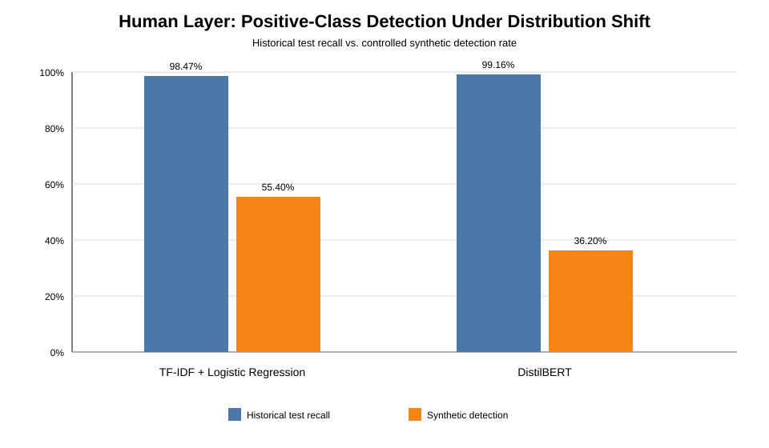
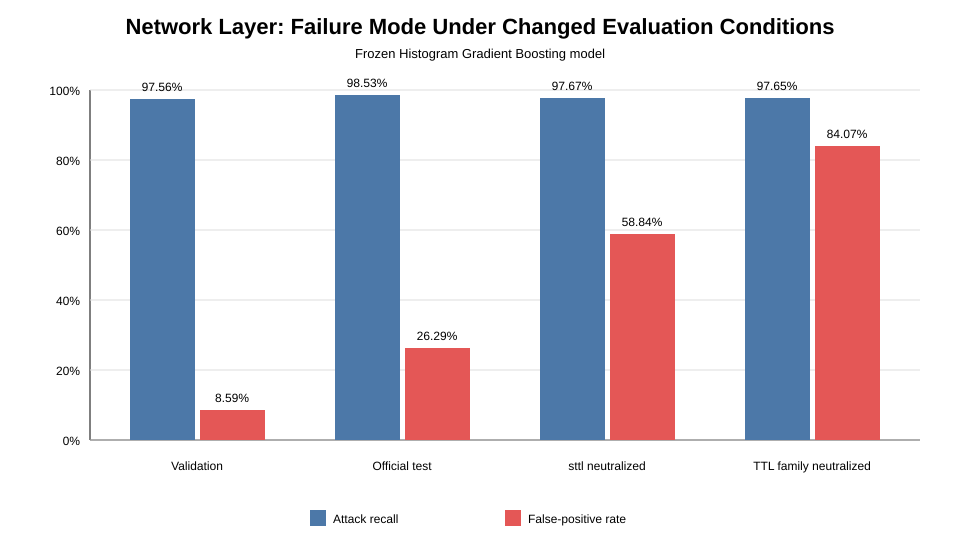

# Evaluating Defensive Machine Learning Under Distribution Shift Across Human and Network Cybersecurity Layers

## Abstract

Machine-learning cybersecurity systems are often evaluated primarily on held-out data drawn from the same or closely related distributions as their training data. This project investigates whether strong benchmark performance persists when defensive models encounter materially different information distributions at two distinct cybersecurity layers: human communication and network traffic.

The Human Layer compared TF-IDF + Logistic Regression with a fine-tuned DistilBERT classifier using 208,161 cleaned historical emails. On an untouched 31,225-email historical test set, the baseline achieved 98.25% accuracy, 98.47% phishing-class recall, and a 1.96% false-positive rate, while DistilBERT achieved 99.23% accuracy, 99.16% recall, and a 0.70% false-positive rate. The same frozen models were then evaluated on a separately constructed, frozen, positive-only set of 500 controlled synthetic phishing-class messages. Detection fell to 55.40% for the baseline and 36.20% for DistilBERT. Of DistilBERT's 319 synthetic misses, 290 were legitimate predictions made with at least 90% raw confidence.

The Network Layer used the official UNSW-NB15 modeling partitions. After leakage auditing and a group-preserving development/validation split, Logistic Regression achieved 93.28% validation accuracy and a false-positive rate of 18.27%. Histogram Gradient Boosting improved validation accuracy to 95.59% and reduced the false-positive rate to 8.59% while retaining 97.56% attack recall. Permutation analysis revealed unusually strong dependence on source TTL. Under a pre-specified controlled `sttl` neutralization experiment, balanced accuracy fell from 94.48% to 69.41% and the false-positive rate rose to 58.84%, while attack recall remained 97.67%. On the untouched official 82,332-row test partition, the frozen stronger model achieved 87.38% accuracy and 98.53% attack recall, but its false-positive rate increased to 26.29%.

The common result is not a single universal failure mechanism. Human-layer shift primarily produced false negatives, while network-layer shift primarily produced false positives. Across both domains, however, strong familiar-distribution performance did not establish robustness to changed information distributions. The project therefore supports a layered evaluation framework centered on leakage controls, untouched evaluation data, explicit false-positive and false-negative analysis, model-dependence analysis, and pre-specified robustness testing rather than aggregate benchmark accuracy alone.

---

## 1. Introduction

Cybersecurity defenses operate across multiple layers. Some systems attempt to identify malicious communication before a user acts on it. Others analyze network behavior for evidence of attacks or suspicious activity. Machine learning can perform strongly in both settings, but high benchmark accuracy does not necessarily answer the more difficult question of whether a detector will remain reliable when the data distribution changes.

This distinction matters because cybersecurity data are not stationary. Email language, social-engineering style, benign communication patterns, network configurations, traffic characteristics, and attack behavior can differ across time, sources, environments, and collection procedures. A detector can therefore learn patterns that are genuinely predictive within its training distribution while still depending on relationships that do not transfer reliably elsewhere.

This project studies that problem through two completed defensive experiments.

The **Human Layer** evaluates phishing-class email detection. It compares an interpretable TF-IDF + Logistic Regression baseline with a contextual DistilBERT transformer. The models are evaluated first on unseen historical email drawn from the familiar dataset distribution and then on a separately frozen controlled synthetic phishing-class distribution.

The **Network Layer** evaluates binary intrusion detection using UNSW-NB15. It compares Logistic Regression with Histogram Gradient Boosting, audits the training data for leakage, measures feature dependence, applies pre-specified controlled feature ablations, and finally evaluates frozen models on the untouched official test partition.

The two studies are not pooled into one statistical experiment. Their datasets, modalities, models, and shift mechanisms differ. Instead, they are integrated around a shared scientific question:

> **Can machine-learning defenses detect cyber threats at both the human communication layer and the network-traffic layer while maintaining low false-positive rates, and how reliably do strong benchmark results persist when the evaluation distribution changes?**

The central thesis is that **defensive machine-learning systems can achieve very high performance on familiar benchmark distributions while remaining vulnerable to materially different failure modes under distribution shift**. Robust evaluation therefore requires more than a single accuracy value.

---

## 2. Background and Related Work

### 2.1 Machine Learning for Phishing Detection

Phishing-email detection has been studied using lexical, structural, statistical, and machine-learning approaches. Salloum et al. surveyed NLP-based phishing detection research and described the use of machine-learning methods to distinguish malicious from legitimate email using textual and structural features [1]. A classical TF-IDF model therefore provides a useful transparent reference point for evaluating whether sparse lexical patterns are sufficient for the task.

Transformer architectures offer a different representation strategy. BERT introduced bidirectional transformer pre-training for downstream NLP tasks [2], and DistilBERT later compressed the BERT architecture through knowledge distillation while retaining much of its language-understanding performance [3]. Recent phishing-detection work has also reported strong performance from transformer-based classifiers [4].

### 2.2 Generative AI and Phishing Robustness

The growing use of generative AI creates an additional evaluation problem. Controlled research has documented stylistic differences in AI-generated phishing-class content [5], and a systematic review of LLM use in phishing research identified both offensive-generation and defensive-detection applications while noting limitations in dataset standardization [6]. Human-subject research on AI-generated deceptive messaging further motivates studying whether natural, contextually fluent communication changes the behavior of defensive systems [7].

Recent studies have begun testing phishing detectors directly against AI-generated or LLM-rephrased messages. Mohan et al. compared lexical and transformer-based representations under generative-AI stress testing and reported substantial differences between ordinary test performance and adversarial/synthetic performance [18]. Ferrell et al. similarly found that LLM-rephrased phishing and safe email could reduce the accuracy of existing detectors, with the magnitude depending on model family [19]. These studies reinforce the need to separate familiar-distribution accuracy from robustness claims. They also show that model ordering under synthetic shift is not universal: results depend on the training corpus, representation, generation procedure, and evaluation design.

### 2.3 Confidence and Out-of-Distribution Behavior

High neural-network confidence does not necessarily imply calibrated correctness. Guo et al. showed that modern neural classifiers can be poorly calibrated [8]. Ovadia et al. further demonstrated that predictive uncertainty can degrade under dataset shift [9]. These findings are relevant to the Human Layer because the transformer is evaluated not only for classification performance but also for whether its raw confidence meaningfully signals failure under the controlled synthetic shift.

### 2.4 Network Intrusion Detection and Dataset Validity

The Network Layer uses UNSW-NB15, a public intrusion-detection benchmark introduced by Moustafa and Slay [11]. The dataset was generated in a controlled cyber-range and contains normal traffic together with multiple attack categories. This structure makes it useful for reproducible model comparison, but its controlled origin also limits claims about current production-network performance.

Longstanding intrusion-detection literature has warned that machine-learning performance in a closed benchmark setting can differ sharply from operational performance. Sommer and Paxson emphasized the semantic, evaluation, and deployment gap between benchmark machine learning and real network intrusion detection [12]. Ring et al. later surveyed network-intrusion datasets and highlighted that recording environment, traffic diversity, labeling, and dataset construction materially affect what an evaluation can support [13].

Dataset construction itself can introduce misleading conclusions. Engelen, Rimmer, and Joosen documented feature-extraction and labeling problems in CICIDS2017 and showed why benchmark integrity must be examined rather than assumed [17]. The present study does not use CICIDS2017, but that case is directly relevant methodologically: benchmark quality, leakage, and collection artifacts can materially alter apparent model performance.

### 2.5 Distribution Shift, Concept Drift, and Security-ML Pitfalls

Security machine learning is particularly exposed to non-stationarity. Shyaa et al. surveyed concept and feature drift in intrusion detection and identified distributional change as a central challenge for adaptive IDS research [15]. Arp et al. analyzed recurring methodological pitfalls in machine-learning security research, including leakage, inappropriate sampling, unrealistic evaluation assumptions, and conclusions that exceed the evidence [14].

These concerns motivate the present study's emphasis on leakage auditing, frozen evaluation conditions, explicit shift testing, and bounded claims. The project does not assume that one stress test represents deployment. Instead, it asks whether strong benchmark results remain stable when information available to a frozen model changes.

False positives also have a specific operational importance in intrusion detection. Axelsson's analysis of the base-rate fallacy showed that even detectors with high attack sensitivity can produce low alert precision when attacks are rare unless false-alarm rates are extremely small [16]. This motivates treating FPR as a primary result rather than a secondary metric.

### 2.6 Cross-Layer Research Gap

The two domains have different operational costs. A phishing detector that produces false negatives can allow malicious communication to pass as legitimate. An intrusion detector that produces excessive false positives can overwhelm analysts or make automated blocking impractical.

The project therefore does not ask whether one universal model can solve both tasks. Instead, it asks whether a common evaluation principle holds across distinct defensive layers: **does strong familiar-distribution performance remain stable after the information distribution changes?**

The contribution is not a claim that distribution shift is newly discovered. Rather, it is an end-to-end cross-layer demonstration using frozen models, explicit leakage controls, untouched final evaluation, controlled stress testing, confidence/error analysis, and layer-specific failure interpretation.

---

## 3. Research Questions

### 3.1 Overarching Question

**Can machine-learning defenses detect cyber threats at both the human communication layer and the network-traffic layer while maintaining low false-positive rates, and how reliably do strong benchmark results persist when the evaluation distribution changes?**

### 3.2 Human Layer Questions

1. How accurately can machine-learning and NLP models distinguish phishing-class from legitimate historical emails while maintaining a low false-positive rate?
2. How robust are frozen historical-email classifiers to a controlled synthetic phishing-class distribution?
3. Does a stronger contextual transformer retain its familiar-distribution advantage under the controlled shift?

### 3.3 Network Layer Questions

1. How accurately can machine-learning models distinguish malicious from benign network traffic while maintaining a low false-positive rate?
2. Which features or feature families does the stronger detector depend on most heavily?
3. How stable is the frozen model under pre-specified feature-information stress tests and the untouched official test distribution?

### 3.4 Cross-Layer Hypothesis

The project expected both layers to support strong conventional classification performance while also exhibiting measurable degradation when evaluated under materially changed distributions. It did not assume that the direction or mechanism of failure would be the same across layers.

---

## 4. Experimental Design

### 4.1 Shared Design Principles

Although the two layers use different data and models, they follow several common principles:

- begin with an interpretable baseline;
- compare a stronger nonlinear or contextual model;
- investigate obvious leakage and artifacts;
- separate development from final evaluation;
- preserve untouched evaluation data where the dataset design permits;
- inspect error patterns rather than relying only on aggregate accuracy;
- evaluate the frozen system under a materially different condition;
- report false-positive and false-negative behavior explicitly;
- avoid treating controlled stress tests as proof of real-world adversarial capability;
- limit conclusions to the population and conditions actually evaluated.

The layers remain statistically separate. No pooled cross-layer accuracy, significance test, or combined performance score is calculated.

### 4.2 Statistical and Operational Analysis

The analysis distinguishes descriptive benchmark metrics from inferential uncertainty.

For binomial detection or false-positive rates, 95% Wilson score intervals are used where counts are available. For the change in Network false-positive rate and recall between internal validation and the official test partition, an independent-proportions Newcombe interval is reported as a descriptive uncertainty interval around the observed percentage-point difference.

The Human synthetic comparison uses the exact paired McNemar test because both frozen classifiers evaluated the same 500 messages. No cross-layer significance test is performed because the Human and Network experiments involve different populations, labels, models, and shift mechanisms.

A base-rate scenario analysis is included for the Network final-test detector to illustrate the relationship among attack prevalence, true-positive rate, false-positive rate, and positive predictive value. These are hypothetical prevalence calculations, not estimates of deployment prevalence or production precision.

---

## 5. Human Layer Methods

### 5.1 Historical Dataset

The Human Layer used the Phishing-Email-Detection-Dataset published by Alhuzali et al. [10]. The merged source contains historical email from multiple public corpora, including Enron, SpamAssassin, TREC, CEAS, Nazario, Nigerian scam collections, and other sources assembled by the dataset authors.

The positive class is broader than narrowly defined credential phishing because spam, scam, and phishing-related content are grouped together in the merged source.

The raw merged dataset contained 213,189 rows. Programmatic cleaning removed records with missing required values, empty or whitespace-only text, unexpected labels, and exact duplicate email bodies.

The final cleaned dataset contained:

- 208,161 emails;
- 108,953 legitimate emails;
- 99,208 phishing-class emails.

A stratified split with seed 42 produced:

| Partition | Total | Legitimate | Phishing-class |
| --- | ---: | ---: | ---: |
| Training | 145,712 | 76,267 | 69,445 |
| Validation | 31,224 | 16,343 | 14,881 |
| Test | 31,225 | 16,343 | 14,882 |

No exact duplicate email bodies crossed the three partitions. The test set remained isolated until the one-shot final historical evaluation.

### 5.2 Baseline Model

The Human Layer baseline used TF-IDF with Logistic Regression. The text representation included unigrams and bigrams, lowercasing, Unicode accent normalization, sublinear term-frequency scaling, and a maximum of 200,000 features. Logistic Regression used the `liblinear` solver and seed 42.

Additional checks evaluated obvious corpus-marker dependence and a length-only classifier. Removing or masking selected source-related artifacts caused only a small performance change, while a length-only classifier reached approximately 59.92% accuracy. These checks indicate that neither simple length nor a small set of obvious source markers alone explained the baseline's approximately 98% validation accuracy.

### 5.3 DistilBERT

The stronger Human Layer model used DistilBERT base uncased with:

- maximum input length 256 tokens;
- training batch size 16;
- evaluation batch size 32;
- two epochs;
- learning rate 2e-5;
- weight decay 0.01;
- validation-F1 model selection;
- seed 42.

A later 512-token inference check produced only a minimal change in validation performance, making truncation an insufficient explanation for the later synthetic-set degradation.

### 5.4 Controlled Synthetic Evaluation

A separate set of 500 controlled synthetic phishing-class messages was created and frozen before either classifier was evaluated on it.

The set contained five designed communication categories with 100 messages each:

1. account/security;
2. workplace/business;
3. delivery/service;
4. promotional/offer;
5. general social engineering.

Generation sources were split evenly between Copilot and Gemini, with 250 messages from each source.

All 500 samples belong to the positive phishing class. The synthetic evaluation therefore measures detection rate/recall but cannot estimate precision, overall accuracy, or false-positive rate for that synthetic distribution.

The messages were intentionally non-operational and generated under defensive safety constraints. They should not be treated as a representative random sample of real-world AI-generated phishing.

---

## 6. Network Layer Methods

### 6.1 Dataset

The Network Layer used the official UNSW-NB15 modeling partitions [11]:

- official training partition: 175,341 rows;
- official testing partition: 82,332 rows;
- observed columns in each downloaded modeling file: 45.

The official test partition was structurally inspected for integrity but withheld from model-development decisions until final evaluation.

### 6.2 Leakage Audit and Feature Policy

Before model training, the training partition was audited for leakage and suspicious structure.

The `id` field was excluded because it strongly encoded dataset ordering and had approximately 0.727 correlation with the target. The `attack_cat` field was excluded because it directly identifies normal versus attack-family membership. `ct_ftp_cmd` was removed because it was identical to `is_ftp_login` throughout the training partition.

The remaining legitimate predictors were retained for initial modeling rather than removing strongly predictive variables merely because they correlated with the target.

### 6.3 Development/Validation Split

The official training partition was divided into development and validation data using complete modeling predictor vectors as groups. Identical predictor vectors were kept within one side of the split.

The result was:

- development: 140,269 rows;
- validation: 35,072 rows;
- identical complete predictor vectors shared across development and validation: 0.

This controls one duplicate-feature leakage pathway but does not prove independence at the host, session, temporal, or campaign level.

### 6.4 Models

The Network Layer baseline used Logistic Regression with standardized numerical variables and one-hot encoded categorical variables fitted on development data only.

The stronger model used Histogram Gradient Boosting with a frozen configuration including:

- 300 maximum iterations;
- learning rate 0.08;
- 31 maximum leaf nodes;
- L2 regularization 1.0;
- seed 42;
- early stopping.

The classification threshold remained 0.50.

### 6.5 Interpretation and Pre-Specified Robustness

Permutation importance was calculated on validation data using balanced accuracy. `sttl` produced the largest individual importance effect, with an approximately 0.2731 mean decrease in balanced accuracy when permuted.

Before robustness execution, a protocol was committed specifying controlled feature-information transformations. Primary conditions included:

- replacing `sttl` with its development-set median;
- replacing `sttl`, `dttl`, and `ct_state_ttl` with development-set medians;
- replacing selected categorical values with unseen-category tokens;
- reporting attack-family behavior.

The frozen model and threshold were retained. These experiments diagnose sensitivity to information removal. They are not simulations of a specific attack.

### 6.6 Final Official Test

After development, model comparison, interpretation, and robustness analysis were frozen, the official 82,332-row test partition was consumed for final evaluation. No post-test tuning is permitted for Network Layer v1.

---

## 7. Human Layer Results

### 7.1 Historical Validation

| Metric | TF-IDF + Logistic Regression | DistilBERT |
| --- | ---: | ---: |
| Accuracy | 98.24% | 99.21% |
| Precision | 97.96% | 99.25% |
| Recall | 98.37% | 99.09% |
| F1 | 98.16% | 99.17% |
| False-positive rate | 1.87% | 0.68% |
| False-negative rate | 1.63% | 0.91% |

DistilBERT made 246 validation errors compared with 548 for the baseline.

### 7.2 Untouched Historical Test

| Metric | TF-IDF + Logistic Regression | DistilBERT |
| --- | ---: | ---: |
| Accuracy | 98.25% | 99.23% |
| Precision | 97.86% | 99.23% |
| Recall | 98.47% | 99.16% |
| F1 | 98.17% | 99.19% |
| False-positive rate | 1.96% | 0.70% |
| False-negative rate | 1.53% | 0.84% |

The close validation-to-test agreement shows that both frozen models generalized strongly to unseen examples drawn from the same historical dataset distribution.

### 7.3 Controlled Synthetic Shift

| Model | Historical test recall | Synthetic detection | Change |
| --- | ---: | ---: | ---: |
| TF-IDF + Logistic Regression | 98.47% | 55.40% | -43.07 pp |
| DistilBERT | 99.16% | 36.20% | -62.96 pp |

The baseline detected 277/500 synthetic messages. DistilBERT detected 181/500.

The model ordering reversed: DistilBERT was stronger on historical data, while the baseline detected substantially more messages on this particular synthetic set.

Because both models evaluated the same 500 messages, an exact two-sided McNemar comparison was performed. The baseline uniquely detected 109 messages, while DistilBERT uniquely detected 13. The exact two-sided p-value was approximately 4.68 × 10^-20, conventionally reported as p < 0.001. This statistical result applies to the designed synthetic set and does not establish universal superiority of the baseline.

### 7.4 Synthetic Failure Pattern

Detection varied sharply by designed communication style.

| Category | Baseline | DistilBERT |
| --- | ---: | ---: |
| Account/security | 99% | 82% |
| Delivery/service | 55% | 28% |
| General social engineering | 20% | 2% |
| Promotional/offer | 84% | 59% |
| Workplace/business | 19% | 10% |

Routine organizational and workplace-style messages were among the most difficult, while recognizable account/security messages were detected much more frequently.

Simple message length did not explain the result. Detected and missed synthetic messages had similar median lengths, and the synthetic messages were typically far shorter than the transformer's context limit.

### 7.5 Confidence Under Shift

DistilBERT missed 319 synthetic messages.

Among those misses:

- 290, or 90.9%, were predicted legitimate with at least 90% raw confidence;
- 233, or 73.0%, were predicted legitimate with at least 99% raw confidence;
- median raw confidence among misses was 99.92%.

The raw softmax output is not treated as a calibrated probability of real-world correctness. The result instead shows that many failures were not accompanied by low model confidence.

---

## 8. Network Layer Results

### 8.1 Validation

| Metric | Logistic Regression | Histogram Gradient Boosting |
| --- | ---: | ---: |
| Accuracy | 93.28% | 95.59% |
| Precision | 92.01% | 96.03% |
| Recall | 98.70% | 97.56% |
| F1 | 95.24% | 96.79% |
| False-positive rate | 18.27% | 8.59% |
| False-negative rate | 1.30% | 2.44% |
| Balanced accuracy | 90.22% | 94.48% |
| ROC AUC | 98.37% | 99.29% |

Histogram Gradient Boosting substantially reduced benign false alarms relative to the baseline while giving up approximately 1.14 percentage points of attack recall.

### 8.2 Error Concentration and Feature Dependence

Of the stronger model's 583 malicious validation misses, 540, or 92.62%, were Fuzzers or Analysis examples.

Permutation importance showed unusually strong reliance on `sttl`. This motivated the already pre-specified TTL-information stress tests.

### 8.3 Controlled Robustness Results

| Condition | Attack recall | False-positive rate | Balanced accuracy |
| --- | ---: | ---: | ---: |
| Reference validation | 97.56% | 8.59% | 94.48% |
| `sttl` neutralized | 97.67% | 58.84% | 69.41% |
| TTL family neutralized | 97.65% | 84.07% | 56.79% |
| All categorical predictors unknown | 99.76% | 23.24% | 88.26% |

Neutralizing `sttl` alone reduced balanced accuracy by 25.07 percentage points and increased FPR by 50.25 percentage points. Neutralizing the broader TTL family reduced balanced accuracy by 37.70 points and increased FPR by 75.48 points.

Attack recall remained high. The principal controlled failure was therefore benign traffic increasingly being labeled malicious.

### 8.4 Untouched Official Test

| Metric | Logistic Regression | Histogram Gradient Boosting |
| --- | ---: | ---: |
| Accuracy | 80.94% | 87.38% |
| Precision | 75.33% | 82.12% |
| Recall | 97.23% | 98.53% |
| F1 | 84.89% | 89.58% |
| False-positive rate | 39.01% | 26.29% |
| False-negative rate | 2.77% | 1.47% |
| Balanced accuracy | 79.11% | 86.12% |
| ROC AUC | 95.59% | 98.48% |

For Histogram Gradient Boosting, the final confusion matrix was:

- true negatives: 27,273;
- false positives: 9,727;
- false negatives: 666;
- true positives: 44,666.

The stronger model retained 98.53% attack recall, but FPR increased from 8.59% internally to 26.29% on the official test.

The controlled TTL ablations and the official test gap are distinct forms of evidence. The project does not claim that TTL dependence caused the official test-set degradation.

### 8.5 Statistical Uncertainty Around Network Generalization

The Network confusion-matrix counts allow uncertainty around the primary rate estimates to be reported directly.

For the stronger Histogram Gradient Boosting model:

| Quantity | Point estimate | 95% Wilson CI |
| --- | ---: | ---: |
| Validation attack recall | 97.56% | 97.35%-97.75% |
| Validation false-positive rate | 8.59% | 8.08%-9.12% |
| Official-test attack recall | 98.53% | 98.42%-98.64% |
| Official-test false-positive rate | 26.29% | 25.84%-26.74% |
| `sttl`-neutralized attack recall | 97.67% | 97.47%-97.85% |
| `sttl`-neutralized false-positive rate | 58.84% | 57.93%-59.75% |
| TTL-family-neutralized attack recall | 97.65% | 97.45%-97.83% |
| TTL-family-neutralized false-positive rate | 84.07% | 83.38%-84.74% |

The official-test FPR exceeded validation FPR by **17.70 percentage points**. A Newcombe 95% interval for this difference is approximately **17.01 to 18.38 percentage points**. Attack recall increased by **0.97 percentage points**, with an approximate Newcombe 95% interval of **0.75 to 1.20 percentage points**.

The intervals reinforce the descriptive conclusion that the main validation-to-test change was not a collapse in attack sensitivity. It was a large deterioration in benign discrimination.

### 8.6 Supplementary Multi-Seed Stability

During publication preparation, the stronger Network model was retrained on the **development partition only** using the same fixed hyperparameters and five predeclared seeds: 7, 17, 29, 42, and 73. The consumed official test partition was not read.

This analysis was post-hoc and is therefore treated as supplementary rather than part of the original frozen v1 protocol.

Across the five seeds:

| Metric | Mean | SD | Min | Max |
| --- | ---: | ---: | ---: | ---: |
| Accuracy | 95.50% | 0.06 pp | 95.45% | 95.59% |
| Attack recall | 97.50% | 0.08 pp | 97.40% | 97.58% |
| False-positive rate | 8.77% | 0.14 pp | 8.59% | 8.91% |
| Balanced accuracy | 94.37% | 0.07 pp | 94.31% | 94.48% |
| ROC AUC | 99.28% | 0.01 pp | 99.27% | 99.29% |

The supplementary environment used scikit-learn 1.8.0 rather than the captured project-machine 1.9.1 environment. However, the seed-42 run reproduced the already verified v1 validation metrics exactly to the precision recorded in the project.

The observed seed variation is small relative to the official-test and controlled robustness gaps. This makes ordinary HGB seed variation an implausible explanation for the much larger FPR changes documented in the primary study.

Full results are preserved in `Network-Layer-Intrusion-Detection/documentation/seed_stability.md`.

---

## 9. Cross-Layer Synthesis

### 9.1 Shared Pattern

The strongest common finding is:

> **High performance on familiar or internal evaluation data did not guarantee stable defensive performance when the information distribution changed.**

The direction of failure differed across layers.

| Layer | Familiar/internal result | Shift result | Dominant observed failure |
| --- | --- | --- | --- |
| Human | DistilBERT 99.23% historical-test accuracy; 99.16% recall | 36.20% detection on controlled synthetic phishing-class set | malicious messages classified as legitimate |
| Network | HGB 95.59% validation accuracy; 8.59% FPR | 26.29% FPR on official test; 58.84% FPR under `sttl` neutralization | benign flows classified as malicious |

### 9.2 Human Failure Cost: False Negatives

In the Human Layer, the synthetic shift primarily exposed missed malicious messages. DistilBERT's historical phishing-class recall was 99.16%, but its synthetic detection rate was 36.20%. Many of these misses were also high-confidence legitimate predictions.

For a defensive communication filter, this type of failure means malicious content can pass through the classifier without triggering a warning.

### 9.3 Network Failure Cost: False Positives

The Network Layer behaved differently. Attack recall remained high across the official test and controlled TTL-information ablations. The larger instability occurred among benign examples.

For an intrusion detector, a false-positive rate that rises from 8.59% to 26.29%, or to much higher levels under controlled feature ablation, can create substantial alert burden. A detector can therefore appear highly sensitive to attacks while still becoming operationally difficult to use.

### 9.4 Why the Metrics Are Not Pooled

The Human synthetic set is positive-only and cannot estimate synthetic FPR or overall accuracy. The Network evaluation contains both classes and uses different shift mechanisms. The experiments also involve different populations, data modalities, sample-construction procedures, and model families.

A cross-layer significance test or combined accuracy score would therefore imply a comparability that the experimental design does not support. The integration is conceptual and comparative rather than a statistical meta-analysis.

---

## 10. Model Complexity and Robustness

Both layers compared a simpler baseline with a stronger nonlinear or contextual model, but the relationship between model strength and robustness was not universal.

### 10.1 Human Layer

DistilBERT clearly outperformed TF-IDF + Logistic Regression on the untouched historical test:

- accuracy: 99.23% vs. 98.25%;
- recall: 99.16% vs. 98.47%;
- FPR: 0.70% vs. 1.96%.

On the controlled synthetic set, however, the ordering reversed:

- baseline detection: 55.40%;
- DistilBERT detection: 36.20%.

### 10.2 Network Layer

Histogram Gradient Boosting remained stronger than Logistic Regression on the official final test:

- accuracy: 87.38% vs. 80.94%;
- recall: 98.53% vs. 97.23%;
- FPR: 26.29% vs. 39.01%.

However, the stronger network model still exhibited substantial feature dependence and benign-discrimination instability under shift.

The supported conclusion is therefore limited:

> **Higher familiar-distribution performance or greater model complexity should not be treated as evidence of distribution-shift robustness.**

The project does not support the stronger claim that simpler models are generally more robust or that complex models are inherently brittle.

---

## 11. Discussion

### 11.1 Benchmark Accuracy Is Necessary but Incomplete

Both studies could have ended with strong conventional results.

The Human Layer could have reported 99.23% DistilBERT historical-test accuracy and a 0.70% false-positive rate. The Network Layer could have reported 95.59% Histogram Gradient Boosting validation accuracy, 99.29% ROC AUC, and 97.56% attack recall.

Those results are valid within their evaluation conditions, but they do not tell the complete story.

The synthetic Human Layer evaluation exposed a 62.96-percentage-point decline in DistilBERT positive-class detection relative to historical-test recall. The Network Layer's untouched official test exposed a 17.70-point increase in FPR relative to internal validation, while the controlled `sttl` ablation exposed a 50.25-point increase.

The added evaluations therefore changed the scientific interpretation from "the classifiers perform strongly" to "the classifiers perform strongly under some distributions but exhibit important and layer-specific instability under others."

### 11.2 Distribution Shift Does Not Have One Failure Signature

The project also shows why distribution shift should not be discussed as if it causes one generic decline in accuracy.

In the Human Layer, the major problem was sensitivity: malicious synthetic messages were missed.

In the Network Layer, the major problem was specificity: benign flows were increasingly labeled malicious while attack recall remained high.

This distinction matters operationally. The first failure can allow threats through. The second can overwhelm the defensive system with alerts.

### 11.3 Confidence Is Not a Safety Signal by Itself

The Human Layer provides a particularly clear example. DistilBERT did not reliably become uncertain when it encountered synthetic messages it misclassified. Most of its synthetic misses received very high raw legitimate-class confidence.

A defensive system therefore should not assume that high model confidence means the input is familiar or the prediction is trustworthy. This is consistent with prior calibration and dataset-shift literature [8,9].

### 11.4 Feature Importance Is Not Causality

The Network Layer's `sttl` dependence is substantial, but its interpretation requires care. Permutation importance and controlled neutralization show that the frozen model relies strongly on TTL-related information. They do not establish that TTL is a causal mechanism of maliciousness, that an attacker can reproduce the exact stress condition, or that TTL dependence caused the official test gap.

The project treats feature reliance as a robustness hypothesis and diagnostic result rather than as an operational attack recipe.

### 11.5 Untouched Evaluation Changes the Strength of Claims

The project uses untouched evaluation in two different ways.

For the Human Layer, the untouched historical test closely reproduced validation performance. This strengthens the claim that the later synthetic decline is not simply ordinary failure on unseen email.

For the Network Layer, the untouched official test revealed a substantial benign-discrimination gap that was much less visible in internal validation.

In both cases, withholding evaluation data until development decisions were frozen materially improved the interpretation of the results.

### 11.6 Base-Rate Scenario Analysis

The Network Layer's false-positive behavior has implications that accuracy and recall alone do not show. Following the base-rate concern formalized by Axelsson [16], positive predictive value depends strongly on the underlying prevalence of attacks.

Using the stronger model's **official-test** true-positive rate of 98.53% and false-positive rate of 26.29%, the implied alert precision under several purely hypothetical attack prevalences is:

| Hypothetical attack prevalence | Implied positive predictive value |
| --- | ---: |
| 0.1% | 0.37% |
| 1% | 3.65% |
| 5% | 16.48% |
| 10% | 29.40% |

These values are **not deployment estimates** because UNSW-NB15 is not a sample of current production prevalence. Their purpose is to show mathematically why a detector can have excellent recall and still generate an impractical alert stream when false-positive rates are high and attacks are uncommon.

### 11.7 Alternative Explanations and Counter-Hypotheses

The Human synthetic decline should not be attributed to AI authorship alone. Several factors changed simultaneously between the historical and synthetic evaluations, including corpus age, source composition, communication style, generation process, message length distribution, and the safety constraints used during synthesis.

Some alternative explanations were partially tested. Message length did not meaningfully separate detected from missed synthetic samples, and generator-source differences were smaller than communication-style differences. However, the study cannot isolate a single causal factor. A factorial external study would be required to separate authorship, recency, style, and corpus-source effects.

The Network official-test gap also has multiple plausible explanations. It could reflect changes in benign feature distributions, attack-family composition, collection conditions, or dependencies learned from training-specific feature relationships. The controlled TTL ablations establish model dependence on TTL-related information but do not identify the cause of the official-test gap.

These unresolved counter-hypotheses are a reason to interpret the project as evidence of **distribution sensitivity** rather than evidence for one universal mechanism.

---

## 12. Limitations

### 12.1 Human Historical Data

Many source emails come from older public corpora. Email language, formatting, benign communication, and attack behavior have changed over time.

The historical positive class is also broad and includes multiple spam, scam, and phishing-related sources rather than only narrowly defined credential phishing.

### 12.2 Human Synthetic Evaluation

The controlled synthetic set contains only 500 messages, only two generation sources, and five designed communication categories. All examples belong to the positive class.

The set was generated under safety constraints and was not randomly sampled from a defined population of real-world AI-generated phishing. Its Wilson intervals and paired statistical comparison quantify the designed experiment but do not establish universal population-level performance.

### 12.3 Human Reproducibility

The frozen TF-IDF baseline was originally serialized under scikit-learn 1.9.1 and later evaluated in an environment using scikit-learn 1.6.1. A compatibility adjustment reproduced the original validation metrics without retraining, but the version mismatch remains a reproducibility limitation.

### 12.4 Network Dataset

UNSW-NB15 was generated in a controlled cyber-range and cannot establish present-day production-network performance.

The group-preserving development/validation split prevents exact complete predictor vectors from crossing partitions, but the available modeling CSV does not provide enough information to prove independence at every host, session, temporal, or campaign level.

### 12.5 Network Robustness Tests

The TTL and categorical transformations are diagnostic ablations. They intentionally remove or alter information and should not be described as realistic adversarial attacks.

The study does not establish that TTL dependence caused the official test-set FPR increase.

### 12.6 Rare Attack Families

Some network attack categories have small sample sizes. Point estimates for rare categories, especially Worms, therefore have substantial uncertainty.

### 12.7 Cross-Layer Comparability

The two layers use different datasets, metrics, models, populations, and shift mechanisms. Their numerical values are not directly pooled. The cross-layer contribution is a repeated evaluation pattern, not a claim that the two tasks have equal difficulty or directly comparable performance.

### 12.8 Deployment Claims

Neither layer establishes that its model is safe for autonomous production blocking. Real deployment would require contemporary external validation, monitoring, calibration, operational testing, and additional safety controls.

### 12.9 Training-Run Variance and Calibration Limits

The Human transformer result is based on the frozen v1 model realization rather than a completed multi-seed DistilBERT training-distribution study. The Human training pipeline uses a fixed seed, which improves reproducibility but does not quantify transformer training-run variance.

For the Network HGB model, a five-seed post-hoc supplementary analysis was completed on development/validation only. Validation FPR varied from 8.59% to 8.91% and balanced accuracy from 94.31% to 94.48%, substantially smaller than the primary distribution-shift effects. Because that analysis was added after v1 completion and used a slightly different scikit-learn version, it is reported as supporting stability evidence rather than part of the original confirmatory design.

The Human confidence analysis is also descriptive rather than a complete calibration study. Because the controlled synthetic set is positive-only, it cannot support a full shifted-distribution reliability analysis across both classes. Future work should report multi-seed variation, Brier score, expected calibration error, and reliability diagrams on a new two-class independent holdout.

### 12.10 External Validation

Neither layer has yet been evaluated under a newly collected or independently sourced contemporary external holdout that is fully separate from the completed v1 benchmark ecosystem. This is the most important remaining limitation for publication-level generalization claims.

A frozen next-stage protocol is preserved in `external_validation_preregistration.md`. The consumed v1 test and synthetic sets will not be reused as unbiased final holdouts after future model changes.

---

## 13. Ethical and Safety Considerations

The project is exclusively defensive.

It does not conduct real phishing campaigns, target real individuals, collect credentials, scan unauthorized systems, probe external networks, deploy malware, or attack live infrastructure.

The Human Layer synthetic messages were generated under constraints intended to keep them non-operational. Their purpose was to evaluate defensive model robustness rather than to improve phishing effectiveness.

The Network Layer uses pre-recorded public network-flow data. Its robustness experiments alter feature information offline and do not interact with live systems.

The prototypes are research demonstrations rather than production security products.

---

## 14. AI Assistance and Researcher Role

AI tools were used as research and development assistants for activities including code drafting and debugging, experiment planning, statistical support, formatting, documentation drafting, and controlled synthetic-message generation.

The researcher selected the research questions, datasets, experimental sequence, model comparisons, safety constraints, evaluation goals, and interpretation boundaries; executed and reviewed the experiments; preserved project artifacts; and determined which results to include.

The Human Layer synthetic set was frozen before classifier evaluation. The Network Layer robustness protocol was frozen before robustness execution. Model results were not used to rewrite the accepted Human synthetic dataset or redefine the pre-specified Network robustness transformations.

Any future school, competition, conference, or publication submission should additionally follow that venue's specific AI-use disclosure policy.

---

## 15. Reproducibility and Research Integrity

The repository preserves source code, methodological documentation, result summaries, hashes, evaluation policies, supplementary seed-stability analysis, and a pre-registered next-stage external-validation protocol.

### 15.1 Human Layer

The Human Layer records:

- cleaning and splitting scripts;
- historical split sizes;
- test and model hashes;
- baseline and transformer configurations;
- synthetic-evaluation methodology;
- validation and final-test results;
- synthetic paired comparison and confidence analysis;
- defensive demo code.

The historical test set is permanently consumed for Human Layer v1. The frozen 500-message synthetic set should also not be reused as an unbiased final evaluation after future tuning informed by its results.

### 15.2 Network Layer

The Network Layer records:

- raw training and test SHA-256 hashes;
- leakage-audit code and decisions;
- group-preserving split logic;
- baseline and stronger-model configurations;
- pre-specified robustness protocol;
- machine-readable verified metrics;
- final-test results;
- captured project-machine package environment, with Python 3.13.5 documented separately.

A final independent audit reran the Network pipeline from the preserved raw CSVs, reproduced the development/validation split, validation metrics, feature-importance ordering, and final-test metrics, and detected an earlier mismatch between written robustness values and the committed robustness code. The robustness experiment was rerun from the frozen protocol and the documentation was corrected before final project integration.

This correction is part of the research record rather than being hidden.

### 15.3 Consumed Evaluation Data

Both final test sets are considered consumed for their respective v1 studies. Future models informed by these results require new independent holdouts for unbiased final performance estimates.

---

## 16. Integrated Scientific Contribution

The project does not claim to have solved phishing detection or network intrusion detection.

Its contribution is an end-to-end defensive evaluation framework demonstrated across two substantially different cybersecurity domains:

1. establish a defensible research question;
2. preserve and document data provenance;
3. audit obvious leakage and artifacts;
4. train an interpretable baseline;
5. compare a stronger model;
6. inspect errors, confidence, and feature dependence;
7. preserve untouched evaluation data;
8. pre-specify robustness conditions where feasible;
9. evaluate under materially changed information distributions;
10. report false-positive and false-negative behavior separately;
11. distinguish diagnostic stress tests from realistic adversarial claims;
12. preserve limitations and corrections as part of the research record.

The most important cross-layer result is that **robustness failure is not captured by one metric or one direction of error**. Human-layer shift exposed high-confidence false negatives. Network-layer shift exposed large increases in false positives. Aggregate benchmark accuracy alone would have obscured both.

---

## 17. Conclusion

This project evaluated defensive machine learning at two cybersecurity layers under both familiar and shifted evaluation conditions.

At the Human Layer, TF-IDF + Logistic Regression and DistilBERT both generalized strongly from validation to an untouched historical test set. DistilBERT achieved 99.23% historical-test accuracy, 99.16% phishing-class recall, and a 0.70% false-positive rate. Yet on a separately frozen positive-only set of 500 controlled synthetic phishing-class messages, its detection rate fell to 36.20%. The simpler baseline fell from 98.47% historical-test recall to 55.40% synthetic detection. DistilBERT's shift failures were especially notable because 290 of its 319 misses were legitimate predictions made with at least 90% raw confidence.

At the Network Layer, Histogram Gradient Boosting improved substantially over Logistic Regression on internal validation, achieving 95.59% accuracy, 97.56% attack recall, and an 8.59% false-positive rate. Interpretation revealed strong dependence on source TTL. Under the pre-specified `sttl` neutralization experiment, attack recall remained 97.67%, but FPR increased to 58.84% and balanced accuracy fell to 69.41%. On the untouched official test partition, attack recall remained 98.53% while FPR increased to 26.29%.

These failures point in opposite operational directions. The Human Layer missed malicious content. The Network Layer increasingly flagged benign traffic. Their commonality is therefore not a shared numerical degradation or a single mechanism. It is the broader finding that **strong performance within a familiar evaluation distribution did not guarantee stable defensive behavior after the information distribution changed**.

For defensive AI research, that distinction changes what should count as convincing evidence. High accuracy and ROC AUC remain useful, but they should be accompanied by leakage controls, independent or untouched evaluation, false-positive and false-negative analysis, model-dependence inspection, and explicit distribution-shift testing. Robustness should be demonstrated rather than inferred from benchmark performance.

---

## References

[1] S. A. Salloum, T. Gaber, S. Vadera, and K. Shaalan, "Phishing Email Detection Using Natural Language Processing Techniques: A Literature Survey," *Procedia Computer Science*, vol. 189, pp. 19-28, 2021. https://doi.org/10.1016/j.procs.2021.05.077

[2] J. Devlin, M.-W. Chang, K. Lee, and K. Toutanova, "BERT: Pre-training of Deep Bidirectional Transformers for Language Understanding," in *Proceedings of NAACL-HLT 2019*, pp. 4171-4186, 2019. https://doi.org/10.18653/v1/N19-1423

[3] V. Sanh, L. Debut, J. Chaumond, and T. Wolf, "DistilBERT, a distilled version of BERT: smaller, faster, cheaper and lighter," arXiv:1910.01108, 2019. https://arxiv.org/abs/1910.01108

[4] M. A. Uddin, M. Mahiuddin, and I. H. Sarker, "An explainable transformer-based model for phishing email detection: A large language model approach," *Computer Networks*, vol. 277, article 112061, 2026. https://doi.org/10.1016/j.comnet.2026.112061

[5] C. S. Eze and L. Shamir, "Analysis and Prevention of AI-Based Phishing Email Attacks," *Electronics*, vol. 13, no. 10, article 1839, 2024. https://doi.org/10.3390/electronics13101839

[6] D. Sivaneswaran et al., "A systematic literature review of large language models in phishing attack generation and detection," *Array*, vol. 30, article 100775, 2026. https://doi.org/10.1016/j.array.2026.100775

[7] J. Francia et al., "Assessing AI-Generated vs. Human-Authored Spear Phishing SMS Attacks: An Empirical Study," *Journal of Cybersecurity and Privacy*, vol. 6, no. 4, article 129, 2026. https://doi.org/10.3390/jcp6040129

[8] C. Guo, G. Pleiss, Y. Sun, and K. Q. Weinberger, "On Calibration of Modern Neural Networks," in *Proceedings of the 34th International Conference on Machine Learning*, PMLR 70, pp. 1321-1330, 2017. https://proceedings.mlr.press/v70/guo17a.html

[9] Y. Ovadia et al., "Can You Trust Your Model's Uncertainty? Evaluating Predictive Uncertainty Under Dataset Shift," in *Advances in Neural Information Processing Systems 32*, 2019. https://proceedings.neurips.cc/paper/2019/hash/8558cb408c1d76621371888657d2eb1d-Abstract.html

[10] A. Alhuzali, A. Alloqmani, M. Aljabri, and F. Alharbi, "Phishing-Email-Detection-Dataset," Zenodo, version 2, 2025. https://doi.org/10.5281/zenodo.17314806

[11] N. Moustafa and J. Slay, "UNSW-NB15: A comprehensive data set for network intrusion detection systems (UNSW-NB15 network data set)," *2015 Military Communications and Information Systems Conference (MilCIS)*, IEEE, 2015. https://doi.org/10.1109/MILCIS.2015.7348942

[12] R. Sommer and V. Paxson, "Outside the Closed World: On Using Machine Learning for Network Intrusion Detection," in *2010 IEEE Symposium on Security and Privacy*, pp. 305-316, 2010. https://doi.org/10.1109/SP.2010.25

[13] M. Ring, S. Wunderlich, D. Scheuring, D. Landes, and A. Hotho, "A survey of network-based intrusion detection data sets," *Computers & Security*, vol. 86, pp. 147-167, 2019. https://doi.org/10.1016/j.cose.2019.06.005

[14] D. Arp, E. Quiring, F. Pendlebury, A. Warnecke, F. Pierazzi, C. Wressnegger, L. Cavallaro, and K. Rieck, "Pitfalls in Machine Learning for Computer Security," *Communications of the ACM*, vol. 67, no. 11, pp. 104-112, 2024. https://doi.org/10.1145/3643456

[15] M. A. Shyaa, N. F. Ibrahim, Z. Zainol, R. Abdullah, M. Anbar, and L. Alzubaidi, "Evolving cybersecurity frontiers: A comprehensive survey on concept drift and feature dynamics aware machine and deep learning in intrusion detection systems," *Engineering Applications of Artificial Intelligence*, vol. 137, article 109143, 2024. https://doi.org/10.1016/j.engappai.2024.109143

[16] S. Axelsson, "The base-rate fallacy and the difficulty of intrusion detection," *ACM Transactions on Information and System Security*, vol. 3, no. 3, pp. 186-205, 2000. https://doi.org/10.1145/357830.357849

[17] G. Engelen, V. Rimmer, and W. Joosen, "Troubleshooting an Intrusion Detection Dataset: the CICIDS2017 Case Study," in *2021 IEEE Security and Privacy Workshops (SPW)*, pp. 7-12, 2021. https://doi.org/10.1109/SPW53761.2021.00009

[18] S. Mohan, S. Sharma, M. M. Unnithan, and S. Basavaraju, "Robust Phishing Detection via Transformer Embeddings and Adversarial Testing with Generative AI," in *2025 International Conference on Intelligent & Innovative Practices in Engineering & Management (IIPEM)*, 2025. https://doi.org/10.1109/IIPEM65914.2025.11548233

[19] A. Ferrell et al., "Evaluating the Effectiveness of Existing Phishing Detectors on AI Generated Phishing Emails," in *2025 Cyber Awareness and Research Symposium (CARS)*, 2025. https://doi.org/10.1109/CARS67163.2025.11337548
