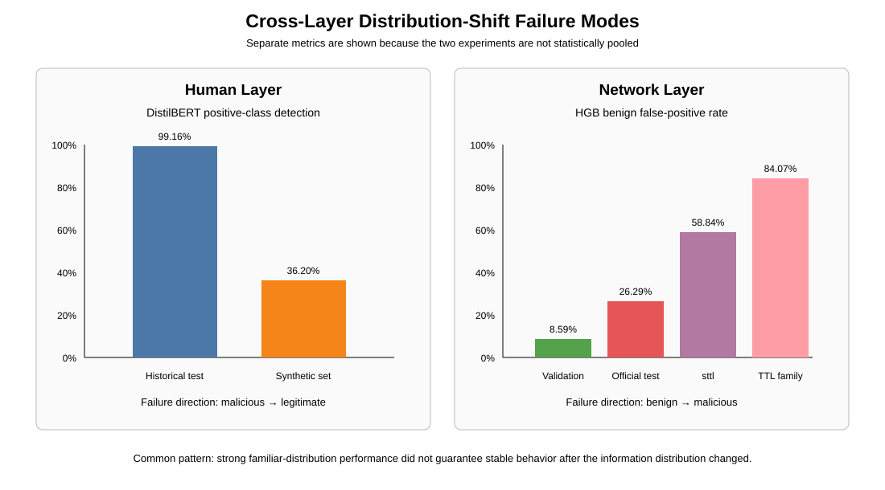
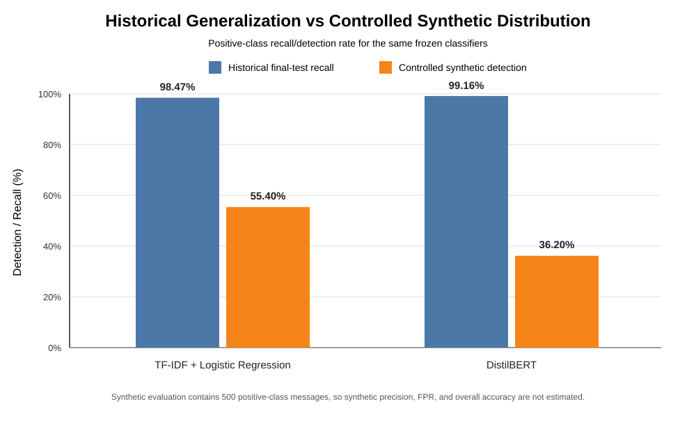

# Defensive AI Cybersecurity

A two-layer defensive machine-learning research project examining a central question:

> **Can machine-learning defenses maintain reliable security decisions across human communication and network-traffic layers when evaluation moves beyond familiar data distributions?**

The project contains two completed v1 studies and a cross-layer integration. The Human Layer evaluates phishing-email classifiers under historical testing and a controlled synthetic text shift. The Network Layer evaluates intrusion-detection models under leakage-resistant validation, pre-specified feature stress tests, and the untouched official UNSW-NB15 test distribution.

## Main Finding

**Strong familiar-distribution performance did not guarantee stable defensive behavior when the information distribution changed.**

The failure direction was different in each layer:

| Layer | Familiar-distribution result | Shift result | Dominant failure |
| --- | --- | --- | --- |
| Human communication | DistilBERT: **99.23%** historical-test accuracy, **99.16%** recall | **36.20%** detection on the frozen controlled synthetic phishing-class set | Malicious messages classified as legitimate |
| Network traffic | HGB: **95.59%** validation accuracy, **8.59%** FPR | **26.29%** FPR on the untouched official test; **58.84%** FPR under controlled `sttl` neutralization | Benign flows classified as malicious |

The two experiments are not pooled statistically. Their datasets, populations, metrics, models, and shift mechanisms differ. The cross-layer result is a repeated evaluation pattern, not a combined performance score.



## Start Here

- **[Combined research paper](Cross-Layer-Integration/documentation/combined_research_paper.md)**: complete integrated paper covering both layers
- **[Cross-layer integration](Cross-Layer-Integration/README.md)**: synthesis, quantitative comparison, figures, and integration framework
- **[Human Layer](Phase-1-Phishing-Detection/README.md)**: phishing-email classification study
- **[Network Layer](Network-Layer-Intrusion-Detection/README.md)**: intrusion-detection study

## Human Layer

### Research question

**How accurately can machine-learning and NLP models distinguish phishing-class from legitimate historical emails while maintaining a low false-positive rate, and how robust are those frozen classifiers to a controlled synthetic phishing-class distribution?**

### Data and models

The cleaned historical dataset contains **208,161 emails**:

- 108,953 legitimate
- 99,208 phishing-class
- training: 145,712
- validation: 31,224
- untouched historical test: 31,225

Models:

- TF-IDF + Logistic Regression
- fine-tuned DistilBERT

### Untouched historical test

| Model | Accuracy | Recall | F1 | FPR |
| --- | ---: | ---: | ---: | ---: |
| TF-IDF + Logistic Regression | 98.25% | 98.47% | 98.17% | 1.96% |
| DistilBERT | 99.23% | 99.16% | 99.19% | 0.70% |

### Controlled synthetic shift

A separately frozen set of **500 positive-class controlled synthetic messages** was created before classifier exposure.

| Model | Historical-test recall | Synthetic detection | Change |
| --- | ---: | ---: | ---: |
| TF-IDF + Logistic Regression | 98.47% | 55.40% | -43.07 pp |
| DistilBERT | 99.16% | 36.20% | -62.96 pp |

Because the synthetic set contains only positive-class examples, it cannot estimate synthetic-set precision, false-positive rate, or overall accuracy.

Of DistilBERT's 319 synthetic misses, **290** were predicted legitimate with at least 90% raw confidence and **233** with at least 99% raw confidence. Raw confidence is not treated as a calibrated probability of correctness.



## Network Layer

### Research question

**How accurately can machine-learning models distinguish malicious from benign network traffic while maintaining a low false-positive rate, and how robust are those models when evaluated under network-traffic distribution shift?**

### Data and models

The study uses the official UNSW-NB15 modeling partitions:

- official training partition: 175,341 rows
- official test partition: 82,332 rows

After a leakage audit, the official training partition was divided into a **140,269-row development set** and **35,072-row validation set** while preventing identical complete modeling predictor vectors from crossing the split.

Models:

- Logistic Regression
- Histogram Gradient Boosting

### Internal validation

| Model | Accuracy | Recall | F1 | FPR | Balanced accuracy |
| --- | ---: | ---: | ---: | ---: | ---: |
| Logistic Regression | 93.28% | 98.70% | 95.24% | 18.27% | 90.22% |
| Histogram Gradient Boosting | 95.59% | 97.56% | 96.79% | 8.59% | 94.48% |

### Controlled feature stress tests

Permutation importance showed unusually strong dependence on `sttl`. Under the pre-specified controlled `sttl` neutralization:

- balanced accuracy: **94.48% → 69.41%**
- FPR: **8.59% → 58.84%**
- attack recall: **97.56% → 97.67%**

Under TTL-family neutralization, FPR increased to **84.07%** while attack recall remained **97.65%**.

These are diagnostic feature-information ablations, not simulations of a specific real-world attack.

### Untouched official test

The frozen Histogram Gradient Boosting model achieved:

- **87.38% accuracy**
- **98.53% attack recall**
- **89.58% F1**
- **26.29% false-positive rate**
- **86.12% balanced accuracy**
- **98.48% ROC AUC**

The official-test degradation was dominated by benign false positives rather than loss of attack sensitivity. The project does not claim that TTL dependence caused the official test gap.

## Why the Two Layers Matter Together

The Human and Network studies expose opposite operational costs of distribution shift.

In the Human Layer, the shifted evaluation produced **false negatives**: malicious messages passed as legitimate.

In the Network Layer, the shifted evaluations primarily produced **false positives**: benign traffic was increasingly flagged as malicious.

This makes the integrated conclusion more specific than “distribution shift lowers accuracy.” Defensive failures can move in different directions depending on the security layer, so evaluation must inspect sensitivity, specificity, confidence, error concentration, and feature dependence rather than relying on one headline metric.

## Research Safeguards

The project includes:

- fixed seeds and documented model configurations;
- raw-data fingerprints where applicable;
- leakage and artifact checks;
- untouched final evaluation sets;
- no post-test tuning for either completed v1 study;
- a frozen Human synthetic set before classifier exposure;
- a pre-specified Network robustness protocol;
- paired statistical testing for the Human synthetic comparison;
- Wilson intervals for relevant subgroup estimates;
- permutation importance and error analysis;
- machine-readable result summaries;
- captured Network project-machine environment;
- an independent computational rerun of the Network pipeline that reproduced core metrics and corrected an earlier robustness-reporting mismatch before integration.

Both final test sets are considered consumed for v1. Future tuned models require new independent holdouts for unbiased final evaluation.

## Repository Map

```text
Defensive-AI-Cybersecurity/
├── README.md
├── Phase-1-Phishing-Detection/
│   ├── README.md
│   ├── data/
│   ├── demo/
│   ├── documentation/
│   ├── models/
│   ├── notebooks/
│   ├── results/
│   └── src/
├── Network-Layer-Intrusion-Detection/
│   ├── README.md
│   ├── data/                 # local/generated; large raw data not tracked
│   ├── demo/
│   ├── documentation/
│   ├── models/               # local/generated model artifacts not tracked
│   ├── results/
│   ├── src/
│   └── network_environment.txt
└── Cross-Layer-Integration/
    ├── README.md
    ├── documentation/
    │   ├── integration_framework.md
    │   ├── quantitative_synthesis.md
    │   └── combined_research_paper.md
    └── results/
        ├── cross_layer_results.csv
        └── figures/
```

Large raw datasets and trained model weights are intentionally not committed directly to the source repository.

## Defensive Prototypes

The Human Layer includes a Streamlit phishing-classification research demo. The trained DistilBERT weights are hosted separately on Hugging Face.

The Network Layer includes a defensive CSV demo that applies the locally trained frozen model to pre-recorded UNSW-NB15-style rows.

Neither prototype is presented as a production security system.

## Scope and Safety

This project is exclusively defensive.

It does not conduct real phishing campaigns, target real individuals, collect credentials, scan unauthorized systems, probe external networks, deploy malware, or attack live infrastructure. The Human synthetic messages were generated under non-operational safety constraints. The Network study uses pre-recorded public network-flow data and offline feature transformations.

## Limitations

The Human historical dataset combines older corpora and uses a broad phishing-class definition. The controlled synthetic set contains 500 positive-class messages from two generation sources and is not a representative random sample of all AI-generated or real-world phishing.

UNSW-NB15 was generated in a controlled cyber-range and does not establish current production-network performance. The Network feature ablations are diagnostic tests rather than realistic adversarial attacks.

Neither layer establishes that its detector is safe for autonomous production blocking.

## Project Thesis

> **Defensive AI systems can achieve very high performance on familiar benchmark distributions while remaining vulnerable to materially different failure modes under distribution shift. Robust evaluation therefore requires layer-specific stress testing, explicit false-positive and false-negative analysis, leakage controls, model-dependence analysis, and untouched final evaluation rather than reliance on aggregate benchmark accuracy alone.**
